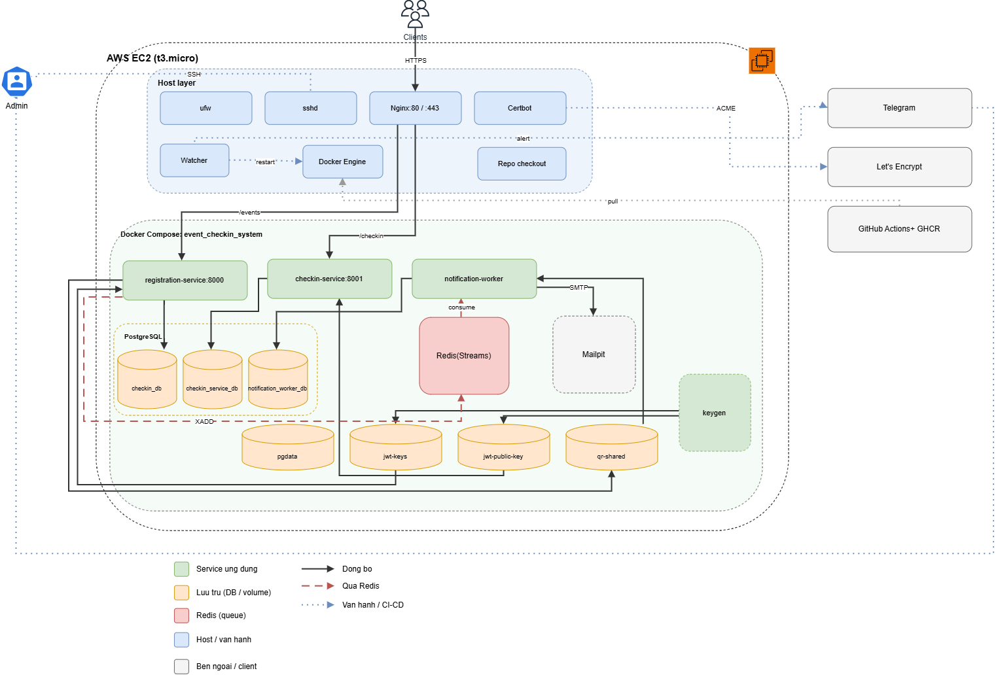
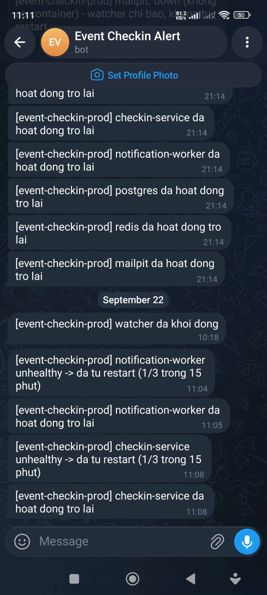
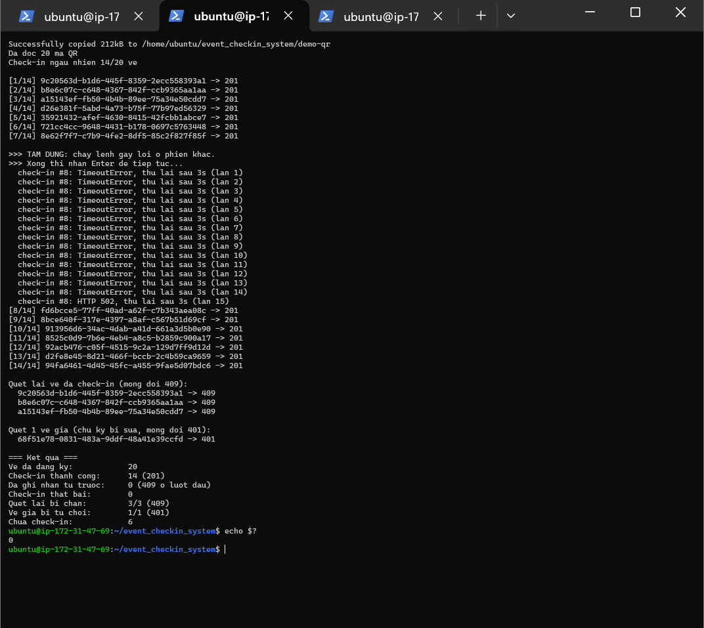

# Event Check-in System

Event ticketing and QR check-in for clubs, workshops and meetups: three small services, a Redis event queue, an Nginx gateway, per-service CI/CD to a single EC2 instance, and a watcher that restarts hung containers and alerts on Telegram.

Stack: Python / FastAPI, PostgreSQL, Redis Streams, Docker Compose, Nginx, GitHub Actions, GHCR, AWS EC2.

## Why this exists

A ticketing flow has a few requirements, and each one forces a design choice:

- Registration must not wait for email delivery, so ticket emails go through a queue and a separate worker.
- A ticket must admit exactly one entry, even when two staff scan it at the same moment, so that guarantee lives in the database, not in application code.
- The gate service must not be able to issue tickets, so tickets are signed JWTs and the check-in service only holds the public key.
- Some failures are not caught by a restart policy (a process that hangs instead of exiting), so health checks and a watcher cover that case.

Each component exists because of one of these problems, not to add tools to the stack.

## Architecture



## Components and ticket flow

|Component|Responsibility|
|-|-|
|`registration-service` (FastAPI, :8000)|Creates events, registers attendees, signs tickets as JWT (RS256, private key), renders the QR code, publishes `ticket_created`|
|`checkin-service` (FastAPI, :8001)|Verifies tickets with the public key only, records check-ins, rejects repeated scans|
|`notification-worker`|Consumes the Redis Stream (consumer group) and emails the QR code|
|Nginx|Routing, SSL (Certbot / Let's Encrypt), rate limit on `/events` (5 req/s per IP, burst 10); `/checkin` is not limited|
|PostgreSQL|One database per service, no shared tables|

Public routes (through Nginx):

|Route|Goes to|
|-|-|
|`POST /events`, `GET /events/{id}`, `POST /events/{id}/register`|`registration-service`|
|`POST /checkin`|`checkin-service`|
|`GET /health-registration`, `GET /health-checkin`|`/health` of each service|

Ticket flow:

1. `POST /events/{id}/register`: `registration-service` stores the registration, signs a JWT (`ticket_id`, `event_id`), renders it as a QR PNG and publishes `ticket_created`. When the event is full it returns `400`.
2. `notification-worker` consumes the event and emails the QR code (one email per `ticket_id`).
3. At the gate, `POST /checkin` with `{"token": "<JWT from the QR>"}`: `checkin-service` verifies the signature and inserts the `ticket_id`. First scan returns `201`, a repeated scan `409`, an invalid or expired token `401`.

## Design decisions

|Problem|What is done here|
|-|-|
|Registration must not wait for email|`ticket_created` goes to a Redis Stream and a separate worker sends the email. If Redis is down, registration still succeeds: the publish failure is logged, not raised|
|A ticket must never be admitted twice|`UNIQUE(ticket_id)` in the check-in database. The service inserts first and handles the integrity error, instead of "query, then insert", which two simultaneous scans can both pass|
|The gate must not be able to forge tickets|Tickets are RS256 JWTs. In production `checkin-service` mounts a volume that contains only `public_key.pem`|
|Redis delivers at least once, so a message can arrive twice|The worker skips tickets already recorded in its own table, and sends the email before recording it|
|A container can hang without exiting|Docker `HEALTHCHECK` plus a watcher that restarts it, with a retry limit|
|Services must not depend on each other's data|Database-per-service|

## Demo

`ops/demo/simulate_event.py` simulates an event against the running stack:

|Command|What it does|
|-|-|
|`register`|Creates an event with 20 seats, registers 20 attendees, then tries a 21st (rejected with `400`, event full)|
|`checkin`|Reads each QR code, checks in a random 70% of the tickets, re-scans 3 of them (`409`) and scans one ticket with a tampered signature (`401`)|
|`report`|Counts how many of the ticket emails arrived in Mailpit|

`register` and `checkin` take `--pause-after N`: the script stops after N requests so a failure can be injected by hand. A request that fails with a connection error, a timeout or `429/502/503/504` is retried until the service is back.

Two runs on the EC2 instance, each freezing one container with `kill -STOP` on its main process. The container keeps running but stops answering, which the Docker restart policy does not notice:

|Run|Failure|Result|
|-|-|-|
|1|`notification-worker` frozen after 10 of 20 registrations|All 20 registrations succeeded. The container became `unhealthy`, the watcher restarted it and sent Telegram alerts, and the worker picked up the pending messages. 20 of 20 emails arrived|
|2|`checkin-service` frozen after 7 of 14 check-ins|The script kept retrying. After the watcher restarted the service, the remaining check-ins went through, re-scans returned `409` and the tampered ticket returned `401`|

Telegram alerts sent by the watcher during both runs:



End of run 2, with the retries while `checkin-service` was frozen and the final summary:



Run it yourself (on the EC2 instance, from the repo root):

```bash
BASE=https://<hostname>
PY=~/tmp-qr-venv/bin/python   # any Python with pyzbar and Pillow (needs the libzbar0 package)
$PY ops/demo/simulate_event.py register --base-url "$BASE" --count 20 --pause-after 10
$PY ops/demo/simulate_event.py checkin  --base-url "$BASE" --pause-after 7
$PY ops/demo/simulate_event.py report   --wait 300
```

`checkin` copies the QR images out of the `registration-service` container with `docker cp`, and `report` reads Mailpit on `127.0.0.1:8025`, so run both on the instance. Against the local dev stack use `--base-url http://localhost:8000 --checkin-url http://localhost:8001` and `--mailpit-url http://localhost:8025`.

## Repository structure

```
registration-service/    FastAPI: events, registrations, ticket signing, QR codes
checkin-service/         FastAPI: ticket verification, check-in records
notification-worker/     Redis Streams consumer, email sender
infra/
  nginx/                 Nginx site config (routing, rate limit)
  postgres-init/         creates the extra databases on the first Postgres start
ops/
  watcher/               watcher.sh, systemd unit, env example
  demo/                  simulate_event.py (simulated event)
  sync.sh                pulls infra files on EC2 and reinstalls the watcher
  recreate.sh            recreates one service, keeping its current image tag
docs/demo/               screenshots used in this README
docker-compose.dev.yml   local stack (builds images, includes Mailpit)
docker-compose.prod.yml  EC2 stack (GHCR images, ports bound to 127.0.0.1)
.github/workflows/       one CI/CD workflow per service
```

## Setup

### Run locally

Requires Docker and the Docker Compose plugin. Optionally create a `.env` file in the repo root with `POSTGRES_PASSWORD=...`; without it Compose uses a default development password.

```bash
docker compose -f docker-compose.dev.yml up -d --build
docker compose -f docker-compose.dev.yml exec registration-service python -m scripts.init_db
docker compose -f docker-compose.dev.yml exec checkin-service python -m scripts.init_db
```

* API docs: http://localhost:8000/docs (registration), http://localhost:8001/docs (check-in)
* Test inbox (Mailpit): http://localhost:8025

### Deploy to EC2

Production runs on one Ubuntu 24.04 `t3.micro`. Only ports 22 (key authentication only), 80 and 443 are open; application ports are bound to `127.0.0.1` and reached through Nginx.

1. Install Docker, Nginx and Certbot. Clone the repo with a read-only deploy key and create `.env` next to `docker-compose.prod.yml` (`POSTGRES_PASSWORD`, `SMTP_HOST`, `SMTP_PORT`, `SMTP_FROM`, `IMAGE_TAG`).
2. Install the Nginx site config, set the hostname, and get a certificate:

```bash
   sudo cp infra/nginx/event-checkin.conf /etc/nginx/sites-available/event-checkin.conf
   sudo sed -i 's/YOUR_HOSTNAME/<hostname>/' /etc/nginx/sites-available/event-checkin.conf
   sudo rm -f /etc/nginx/sites-enabled/default
   sudo ln -sf /etc/nginx/sites-available/event-checkin.conf /etc/nginx/sites-enabled/
   sudo nginx -t && sudo systemctl reload nginx
   sudo certbot --nginx -d <hostname>
```

3. Add `EC2_HOST`, `EC2_USERNAME` and `EC2_SSH_KEY` to GitHub Actions Secrets. This is a different SSH key from the deploy key in step 1.
4. Merge to `main`: CI builds and pushes the images to GHCR. If the packages are private, run `docker login ghcr.io` on the instance first.
5. On a new server nothing is running yet. CD only recreates the service whose code changed, and with `--no-deps` it never starts `postgres`, `redis` or `keygen`. Start the stack once by hand with `docker compose -f docker-compose.prod.yml up -d`. After that, never run a bare `up -d` again: each service can be on its own image tag, while `.env` only holds `IMAGE_TAG=latest`.
6. Create the tables once with `docker compose -f docker-compose.prod.yml exec <service> python -m scripts.init_db`, for `registration-service` and `checkin-service`.
7. Create `/etc/event-checkin-watcher.env` from `ops/watcher/watcher.env.example` (Telegram bot token and chat ID), then run `bash ops/sync.sh`.

CD only pulls images and never runs `git pull` on the server. Infrastructure files change through `bash ops/sync.sh`, and one service is recreated with `bash ops/recreate.sh <service>`.

## Testing

* Each service has its own `pytest` suite: 8 tests for `registration-service`, 7 for `checkin-service`, 13 for `notification-worker`. Tests run on SQLite in memory, so no Postgres is needed. The `registration-service` and `checkin-service` tests generate a temporary RSA key pair, and `checkin-service` also covers a forged signature and an expired token.
* `notification-worker` tests use `fakeredis` by default (12 run, the dead-letter test is skipped). That test needs Redis's real delivery counter, so set `TEST_REDIS_URL` to a Redis 6.2+ instance (for example `redis://localhost:6379/15`) to run all 13. The fixture runs `FLUSHDB` on that database before and after each test, so always point it at a dedicated database. CI always runs in this mode.
* End-to-end check, done by hand or with the demo script: register, decode the QR, check in twice (`201`, then `409`), and confirm the email in Mailpit.

## CI/CD

* Each service has its own GitHub Actions workflow that only runs when its directory changes.
* Pull request: `lint (ruff)` then `test (pytest)`.
* Push to `main`: additionally `build-and-push` (image to GHCR, tagged with the commit SHA and `latest`) and `deploy` (SSH into EC2, `docker compose pull`, then `up -d --no-deps <service>`).

## Self-healing

|Failure|Detected by|Action|
|-|-|-|
|Process exits|Docker (`restart: unless-stopped`)|Container is restarted|
|Container runs but hangs|`HEALTHCHECK` in the Dockerfile, then the watcher|`docker restart`, at most 3 times per 15 minutes, then the watcher gives up and alerts|
|Email fails, or the worker dies mid-message|`XAUTOCLAIM` in the worker|Message is retried; after 5 failed attempts it moves to the `ticket_created_dead` stream|
|Postgres, Redis or Mailpit down; disk full; low memory; Nginx down; Docker daemon unresponsive|Watcher|Telegram alert only (services that hold data are never restarted automatically)|

The watcher is a bash script run by systemd on the host, not a container: a watcher container would need the Docker socket, cost memory on a 1 GB instance, and go down together with the stack it watches.

## Known issues found while building this

* The worker crashed with `FileNotFoundError` on a QR file that existed. The path was relative, and the worker runs in a different working directory than `registration-service`. The service now publishes an absolute path.
* The worker first recorded a ticket as "sent" and then sent the email. A failed send left the ticket marked as done and it was never retried. The order is now send first, record after. A crash between the two steps can send a duplicate email, which is acceptable with at-least-once delivery.
* Reading only new messages (`>`) leaves failed messages in the Pending Entries List forever. The worker now runs `XAUTOCLAIM` on startup and every 30 seconds, and moves a message to a dead-letter stream after 5 failed attempts. `XAUTOCLAIM` needs Redis 6.2+, and the Redis in Ubuntu 22.04's package repository is 6.0, so tests against a real Redis use the `redis:7` image.
* `registration-service` tests passed locally but failed on a clean checkout, because they read the real `keys/private_key.pem`, which is git-ignored. Tests now generate a temporary key pair.
* `docker compose up -d <service>` also recreated its dependency `keygen`, whose image tag did not exist for that commit, so the deploy failed at the pull step. The running containers were untouched. The command now uses `--no-deps`.
* `keygen` failed with `Permission denied` on a volume mounted into a directory that did not exist in the image: Docker created it as root, and the container runs as a non-root user. The directory is now created and `chown`ed in the Dockerfile.
* The `sslip.io` hostname, the certificate and the `EC2_HOST` secret all derive from the instance's public IP, and stopping then starting the instance changes it. Only reboot the instance, or attach an Elastic IP.

## Limitations

* A single EC2 `t3.micro`, no high availability. Postgres runs in a container on the same machine and has no automated backup.
* Redis has no volume, so queued messages are lost if its container is removed or recreated.
* `/health` only shows that the web process answers. It does not check Postgres or Redis; the watcher alerts on those separately.
* Email goes through Mailpit, a test inbox that does not deliver real mail. Switching to a real SMTP server only needs `SMTP_HOST`, `SMTP_PORT` and `SMTP_FROM`, but `notifier.py` has no TLS or authentication yet.
* SSH is open to all IPs so that GitHub Actions can connect. Password login is disabled and only key authentication is accepted.
* Bringing up a brand-new server from scratch (step 5 of the deploy section) was not re-tested after CD switched to `--no-deps`.
